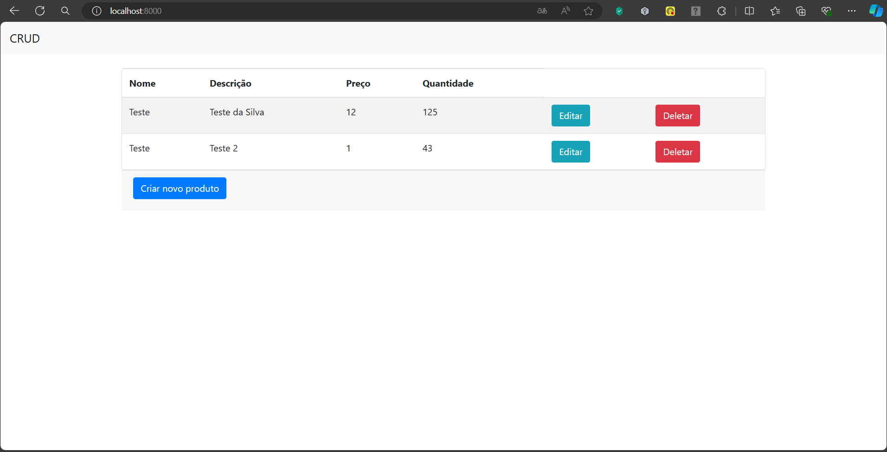

<h1 align="center"> Cadastro de produtos em GoLang </h1>
<h2>Este projeto foi feito na linguagem goLang, com o intuito de apredizado e prática</h2>
<h3>O projeto também possui um frontend simples com o intuito de testar as persitências e integrações, o qual foi
usado o bootstrap.</h3>
<h3>O projeto foi constuido utilizando o padrão MVC</h3>

Para subir o banco de dados, inicie o docker para subir o banco de dados:
```bash
docker-compose up -d
```

Para rodar o projeto execute o camando:
```bash
go run main.go
```

Após iniciado, basta acessar http://localhost:8000

